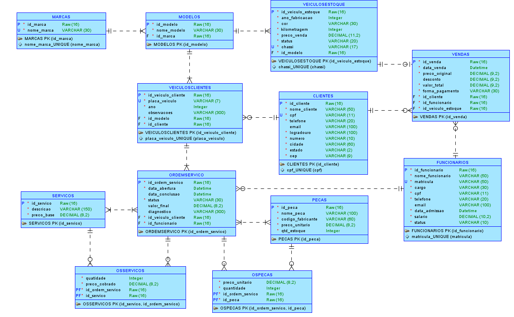

<h1 align="center">CP1 - (MER) e Criação do Projeto WebAPI </h1>

###

<h2 align="center">📋Integrantes📋</h2>

###

<table align="center">
    <tr>
        <td align="center">
            
            <br>
            <sub>
                <b>Matheus Roque</b><br>
                <b>Rm: 561959</b>
            </sub>
        </td>
        <td align="center">
            
            <br>
            <sub>
                <b>Giovane dos Santos</b><br>
                <b>Rm: 561336</b>
            </sub>
        </td>
    </tr>
</table>

---

<h2 align="center">🚗 Domínio Escolhido</h2>

<p align="center">
  O domínio escolhido é o de uma <b>concessionária de veículos com oficina mecânica</b>.<br>
  O sistema contempla dois módulos distintos: vendas de veículos do estoque e gestão de ordens de serviço da oficina.
</p>

---

<h2 align="center">🗂️ Entidades Modeladas</h2>

<table align="center">
    <tr>
        <th>Entidade</th>
        <th>Descrição</th>
    </tr>
    <tr><td>Marca</td><td>Fabricantes dos veículos (ex: Toyota, Honda)</td></tr>
    <tr><td>Modelo</td><td>Modelos de cada marca (ex: Corolla, Civic)</td></tr>
    <tr><td>Cliente</td><td>Clientes da concessionária e oficina</td></tr>
    <tr><td>Funcionario</td><td>Vendedores e mecânicos da empresa</td></tr>
    <tr><td>VeiculoCliente</td><td>Veículos dos clientes trazidos para reparo na oficina</td></tr>
    <tr><td>VeiculoEstoque</td><td>Veículos disponíveis para venda na concessionária</td></tr>
    <tr><td>Servico</td><td>Catálogo de serviços oferecidos pela oficina</td></tr>
    <tr><td>Peca</td><td>Catálogo de peças utilizadas nos reparos</td></tr>
    <tr><td>OrdemServico</td><td>Ordens de serviço abertas na oficina</td></tr>
    <tr><td>OsServico</td><td>Tabela pivot — serviços executados em cada OS</td></tr>
    <tr><td>OsPeca</td><td>Tabela pivot — peças utilizadas em cada OS</td></tr>
    <tr><td>Venda</td><td>Registro das vendas de veículos do estoque</td></tr>
</table>

---

<h2 align="center">🔗 Resumo dos Relacionamentos</h2>

| Entidades | Cardinalidade | Tipo | Observação |
|---|---|---|---|
| Marca → Modelo | 1:N | Não-identificador | Uma marca tem vários modelos |
| Modelo → VeiculoCliente | 1:N | Não-identificador | Um modelo aparece em vários veículos de clientes |
| Modelo → VeiculoEstoque | 1:N | Não-identificador | Um modelo aparece em vários veículos do estoque |
| Cliente → VeiculoCliente | 1:N | Não-identificador | Um cliente pode ter vários veículos na oficina |
| Cliente → Venda | 1:N | Não-identificador | Um cliente pode fazer várias compras |
| VeiculoCliente → OrdemServico | 1:N | Não-identificador | Um veículo pode ter múltiplas OS |
| VeiculoEstoque → Venda | 1:1 | Exclusiva | Um veículo do estoque é vendido apenas uma vez |
| Funcionario → OrdemServico | 1:N | Não-identificador | Um mecânico atende múltiplas OS |
| Funcionario → Venda | 1:N | Não-identificador | Um vendedor faz múltiplas vendas |
| OrdemServico ↔ Servico | N:N | Identificador | Via OsServico — linha sólida |
| OrdemServico ↔ Peca | N:N | Identificador | Via OsPeca — linha sólida |

---

<h2 align="center">📐 MER</h2>

<p align="center">
  
</p>

---

<h2 align="center">🏗️ Estrutura do Projeto</h2>

```
AutoHub/
├── docs/
│   └── MER.png
├── src/
│   ├── AutoHub.API
│   ├── AutoHub.Application
│   ├── AutoHub.Domain
│   │   └── Entities/
│   │       ├── Marca.cs
│   │       ├── Modelo.cs
│   │       ├── Cliente.cs
│   │       ├── Funcionario.cs
│   │       ├── VeiculoCliente.cs
│   │       ├── VeiculoEstoque.cs
│   │       ├── Servico.cs
│   │       ├── Peca.cs
│   │       ├── OrdemServico.cs
│   │       ├── OsServico.cs
│   │       ├── OsPeca.cs
│   │       └── Venda.cs
│   └── AutoHub.Infrastructure
└── README.md
```