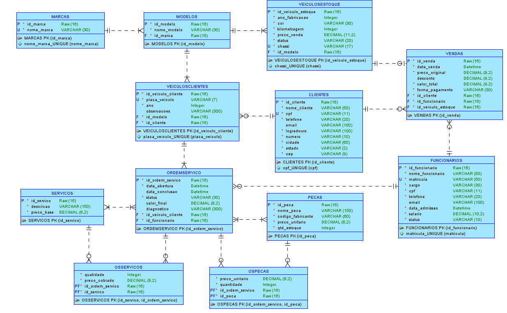

<h1 align="center">AutoHub — Concessionária & Oficina Mecânica</h1>

<p align="center">
  Projeto desenvolvido para as disciplinas de CP1, CP2, CP3, CP4 e CP5 — FIAP
</p>

---

<h2 align="center">📋 Integrantes</h2>

<table align="center">
    <tr>
        <td align="center">
            
            <br>
            <sub>
                <b>Matheus Roque</b><br>
                <b>RM: 561959</b>
            </sub>
        </td>
        <td align="center">
            
            <br>
            <sub>
                <b>Giovane dos Santos</b><br>
                <b>RM: 561336</b>
            </sub>
        </td>
    </tr>
</table>

---

<h2 align="center">🚗 Domínio Escolhido</h2>

<p align="center">
  O domínio escolhido é o de uma <b>concessionária de veículos com oficina mecânica</b>.<br>
  O sistema contempla dois módulos integrados: venda de veículos do estoque e gestão de ordens de serviço da oficina (manutenções, serviços e peças).
</p>

---

<h2 align="center">🗂️ Entidades Modeladas</h2>

<table align="center">
    <tr>
        <th>Entidade</th>
        <th>Descrição</th>
    </tr>
    <tr><td>Marca</td><td>Fabricantes dos veículos (ex: Toyota, Honda)</td></tr>
    <tr><td>Modelo</td><td>Modelos de cada marca (ex: Corolla, Civic)</td></tr>
    <tr><td>Cliente</td><td>Clientes da concessionária e oficina mecânica</td></tr>
    <tr><td>Funcionario</td><td>Vendedores e mecânicos da empresa</td></tr>
    <tr><td>VeiculoCliente</td><td>Veículos dos clientes trazidos para reparo na oficina</td></tr>
    <tr><td>VeiculoEstoque</td><td>Veículos disponíveis para venda no pátio</td></tr>
    <tr><td>Servico</td><td>Catálogo de serviços oferecidos pela oficina</td></tr>
    <tr><td>Peca</td><td>Catálogo de peças e componentes mecânicos</td></tr>
    <tr><td>OrdemServico</td><td>Ordens de serviço abertas para manutenção</td></tr>
    <tr><td>OsServico</td><td>Tabela pivot — serviços executados em cada OS</td></tr>
    <tr><td>OsPeca</td><td>Tabela pivot — peças utilizadas em cada OS</td></tr>
    <tr><td>Venda</td><td>Registro das vendas de veículos do estoque</td></tr>
</table>

---

<h2 align="center">🔗 Relacionamentos</h2>

| Entidades                     | Cardinalidade | Observação                                       |
| ----------------------------- | ------------- | ------------------------------------------------ |
| Marca → Modelo                | 1:N           | Uma marca tem vários modelos                     |
| Modelo → VeiculoCliente       | 1:N           | Um modelo aparece em vários veículos de clientes |
| Modelo → VeiculoEstoque       | 1:N           | Um modelo aparece em vários veículos do estoque  |
| Cliente → VeiculoCliente      | 1:N           | Um cliente pode ter vários veículos na oficina   |
| Cliente → Venda               | 1:N           | Um cliente pode fazer várias compras             |
| VeiculoCliente → OrdemServico | 1:N           | Um veículo pode ter múltiplas OS                 |
| VeiculoEstoque → Venda        | 1:1           | Um veículo do estoque é vendido apenas uma vez   |
| Funcionario → OrdemServico    | 1:N           | Um mecânico atende múltiplas OS                  |
| Funcionario → Venda           | 1:N           | Um vendedor faz múltiplas vendas                 |
| OrdemServico ↔ Servico        | N:N           | Via tabela pivot OsServico                       |
| OrdemServico ↔ Peca           | N:N           | Via tabela pivot OsPeca                          |

---

<h2 align="center">📐 MER</h2>

<p align="center">
  
</p>

---

<h2 align="center">🏗️ Estrutura do Projeto (Clean Architecture)</h2>

```
AutoHub/
├── docs/
│   ├── MerDiagram.png
│   ├── health-healthy.json         → Evidência de Health Check (200 OK)
│   ├── health-unhealthy.json       → Evidência de Health Check com falha (503)
│   └── logs-observability.txt      → Evidência de logs estruturados com TraceId
├── src/
│   ├── AutoHub.Domain/             → Regras de negócio puras, entidades e exceções de domínio
│   │   ├── Common/                 → BaseEntity com Id Guid
│   │   ├── Entities/               → Marca, Modelo, Cliente, VeiculoEstoque, etc.
│   │   └── Exceptions/             → DomainException, ResourceNotFoundException, ConflictException
│   ├── AutoHub.Application/        → Contratos de repositório, DTOs e serviços de aplicação
│   │   ├── DTOs/                   → Request e Response DTOs para Clientes, Marcas, Veículos
│   │   ├── Interfaces/             → IRepository<T>, IClienteService, IMarcaService, etc.
│   │   └── Services/               → ClienteService, MarcaService, VeiculoEstoqueService
│   ├── AutoHub.Infrastructure/     → EF Core, SQLite, DbContext, Migrations e Repositórios
│   │   ├── Data/                   → ApplicationDbContext, Configurations (Fluent API), DataSeeder
│   │   └── Repositories/           → Repository<T> genérico
│   └── AutoHub.API/                → Controllers, Swagger, Health Checks e Exception Handler
│       ├── Controllers/            → ClientesController, MarcasController, VeiculosEstoqueController, SeedController
│       ├── Exceptions/             → GlobalExceptionHandler (IExceptionHandler + RFC 7807)
│       └── Extensions/             → SwaggerExtensions, HealthCheckExtensions, RateLimitExtensions
├── tests/
│   ├── AutoHub.Domain.Tests/       → Testes unitários do domínio sem mock (xUnit, Fact, Theory)
│   ├── AutoHub.Application.Tests/  → Testes de serviços de aplicação com Mock de repositório (Moq)
│   └── AutoHub.Infrastructure.Tests/ → Paginação com SQLite em memória
└── README.md
```

---

<h2 align="center">🚀 Como Executar o Projeto</h2>

### Pré-requisitos
- **.NET 9 SDK** instalado.
- Banco de dados: **SQLite** (gerado automaticamente no arquivo `autohub.db`).

### Execução da API
```bash
# Na raiz do repositório AutoHub
# 1. Restaurar dependências
dotnet restore

# 2. Executar a API
dotnet run --project src/AutoHub.API
```

Endpoints principais:
- **Swagger UI:** `http://localhost:5017/swagger`
- **Health Check:** `http://localhost:5017/health`

### Execução dos Testes Automatizados
```bash
# Executar todos os testes da solução
dotnet test
```

---

<h2 align="center">📌 CP3 — API REST, Swagger, Repositório e Erros Globais</h2>

### 1. Controllers e DTOs
A API opera sobre DTOs de entrada e saída, desacoplada do `DbContext`:

| Recurso | Método | Rota | Descrição |
| --- | --- | --- | --- |
| **Seed** | POST | `/api/seed` | Popula o banco com dados de exemplo |
| **Clientes** | GET | `/api/clientes` | Lista todos os clientes |
| **Clientes** | GET | `/api/clientes/{id}` | Busca cliente por ID (GUID) |
| **Clientes** | POST | `/api/clientes` | Cria novo cliente com validação de CPF |
| **Clientes** | PUT | `/api/clientes/{id}` | Atualiza dados do cliente |
| **Clientes** | DELETE | `/api/clientes/{id}` | Remove cliente |
| **Marcas** | GET | `/api/marcas` | Lista marcas |
| **Marcas** | GET | `/api/marcas/{id}` | Busca marca por ID |
| **Marcas** | POST | `/api/marcas` | Cadastra nova marca |
| **Marcas** | PUT | `/api/marcas/{id}` | Atualiza marca |
| **Marcas** | DELETE | `/api/marcas/{id}` | Remove marca |
| **Veículos Estoque** | GET | `/api/veiculos-estoque` | Lista veículos à venda |
| **Veículos Estoque** | GET | `/api/veiculos-estoque/{id}` | Busca veículo por ID |
| **Veículos Estoque** | POST | `/api/veiculos-estoque` | Cadastra veículo validando modelo e chassi |
| **Veículos Estoque** | PUT | `/api/veiculos-estoque/{id}` | Atualiza veículo em estoque |
| **Veículos Estoque** | DELETE | `/api/veiculos-estoque/{id}` | Remove veículo do estoque |
| **Health** | GET | `/health` | Relatório de disponibilidade operacional da API e banco |

### 2. Swagger Completo com Comentários XML
- Metadados corporativos, documentos `v1` e `v2` e documentação de ações e schemas (ver CP5).
- XML Comments ativados via `<GenerateDocumentationFile>true</GenerateDocumentationFile>` e vinculados ao Swagger.
- Respostas HTTP tipadas com `[ProducesResponseType]` (200, 201, 204, 400, 404, 409, 500).

### 3. Repositório Genérico Tipado
- Contrato `IRepository<T>` na camada **Application**, com restrição `where T : BaseEntity`.
- Implementação `Repository<T>` na **Infrastructure** com EF Core, `.AsNoTracking()` e `ExistsByIdAsync()`.
- Injeção de dependência via `AddScoped(typeof(IRepository<>), typeof(Repository<>))`.

### 4. Tratamento Global de Exceções (RFC 7807)
- Middleware centralizado implementando `IExceptionHandler` em `GlobalExceptionHandler.cs`.
- Retorno padronizado em formato **RFC 7807 (`application/problem+json`)**.

| Exceção | Status HTTP | RFC 7807 Title | Cenário |
| --- | --- | --- | --- |
| `ResourceNotFoundException` | **404 Not Found** | Recurso não encontrado | Registro inexistente por ID |
| `KeyNotFoundException` | **404 Not Found** | Recurso não encontrado | Chave informada inexistente |
| `ConflictException` | **409 Conflict** | Conflito de dados | CPF, chassi ou marca duplicada |
| `DomainException` | **400 Bad Request** | Violação de regra de negócio | Invariante de domínio inválida |
| `ArgumentException` | **400 Bad Request** | Parâmetro inválido | Dados de entrada malformados |
| `Exception` (inesperada) | **500 Internal Server Error** | Erro interno no servidor | Erros não tratados (ocultos fora de Dev) |

---

<h2 align="center">🛡️ CP4 — Health Checks, Observabilidade e Testes Automatizados</h2>

### 1. Health Checks Operacionais (`GET /health`)
A API expõe o endpoint **`GET /health`** com um **Response Writer JSON customizado** que detalha o status de todos os componentes essenciais:

* **Checks Registrados:**
  1. **`self`**: Verifica se o processo da aplicação ASP.NET Core está ativo e respondendo (`HealthCheckResult.Healthy`).
  2. **`database`**: Verifica a conectividade real com o banco de dados via `AddDbContextCheck<ApplicationDbContext>()` do pacote `Microsoft.Extensions.Diagnostics.HealthChecks.EntityFrameworkCore`.
* **Mapeamento de Status HTTP:**
  * **Healthy (200 OK):** Processo e banco operando normalmente.
  * **Degraded (200 OK):** Aplicação serve tráfego com alertas.
  * **Unhealthy (503 Service Unavailable):** Falha no banco de dados ou em dependências críticas.

#### Exemplo de Resposta Saudável (200 OK):
```json
{
  "status": "Healthy",
  "totalDuration": "00:00:00.0250687",
  "checks": [
    {
      "name": "self",
      "status": "Healthy",
      "duration": "00:00:00.0016803",
      "description": "A API está operando normalmente.",
      "tags": [ "live" ]
    },
    {
      "name": "database",
      "status": "Healthy",
      "duration": "00:00:00.0184479",
      "tags": [ "ready", "db" ]
    }
  ]
}
```

#### Simulação de Falha de Banco (503 Service Unavailable):
Ao simular indisponibilidade do banco de dados (ex.: parada do SGBD ou erro de arquivo SQLite), o endpoint retorna **503** indicando qual check falhou:
```json
{
  "status": "Unhealthy",
  "totalDuration": "00:00:00.0512341",
  "checks": [
    {
      "name": "self",
      "status": "Healthy",
      "duration": "00:00:00.0012000",
      "description": "A API está operando normalmente.",
      "tags": [ "live" ]
    },
    {
      "name": "database",
      "status": "Unhealthy",
      "duration": "00:00:00.0500341",
      "tags": [ "ready", "db" ],
      "exception": "SQLite Error 14: 'unable to open database file'."
    }
  ]
}
```

---

### 2. Observabilidade e Logs Estruturados com TraceId
A instrumentação de logs utiliza `ILogger<T>` nativo de forma estruturada:
* **Propriedades nomeadas** nos logs de escrita (POST e PUT), registrando início e conclusão da operação.
* **Correlação via `traceId` (`HttpContext.TraceIdentifier`):** O mesmo identificador de rastreamento é propagado no log da Controller, no log do `GlobalExceptionHandler` e no campo `traceId` da resposta RFC 7807 (`ProblemDetails`).
* **Segurança:** Stack trace e exceções internas detalhadas só são registradas nos logs e exibidas em `ProblemDetails` durante ambiente de desenvolvimento (`Development`), mantendo a produção protegida.

---

### 3. Pirâmide de Testes Automatizados com xUnit

A suíte de testes foi estruturada em dois projetos dedicados na solution:

#### A) `AutoHub.Domain.Tests` (Testes de Unidade de Domínio — Sem Mock)
* **Objetivo:** Garantir que as entidades do domínio aplicam suas invariantes de negócio de forma isolada, sem depender de banco ou da API.
* **Padrão AAA (Arrange, Act, Assert):**
  * `[Fact]`: Validação do caminho feliz para entidades `Cliente` e `VeiculoEstoque`.
  * `[Theory] + [InlineData]`: Validação de caminhos de erro com lançamento de `DomainException`:
    * CPF com tamanho incorreto ou caracteres inválidos.
    * E-mail malformado.
    * Veículo com preço menor ou igual a zero.
    * Ano de fabricação fora do intervalo aceitável.
    * Chassi com menos de 17 caracteres.

#### B) `AutoHub.Application.Tests` (Testes de Serviços de Aplicação — Com Mock)
* **Objetivo:** Testar os casos de uso e serviços da aplicação (`ClienteService`, `VeiculoEstoqueService`) isolando a camada de persistência com o **Moq**.
* **Cenários Testados:**
  * **Dependência Ausente:** Ao tentar cadastrar um `VeiculoEstoque` com um `ModeloId` inexistente, o serviço lança `ResourceNotFoundException` e o mock garante que `AddAsync` e `SaveChangesAsync` **nunca foram chamados** (`Times.Never`).
  * **Conflito de Regra:** Ao tentar cadastrar um cliente com CPF já registrado, lança `ConflictException` e garante `Times.Never` na persistência.
  * **Caminho Feliz:** Ao criar entidades com dados válidos, garante que o repositório foi chamado para persistir exatamente uma vez (`Times.Once`).

#### Resultado histórico da CP4 (anterior à CP5):
```text
$ dotnet test
Passed!  - Failed: 0, Passed: 19, Skipped: 0, Total: 19 - AutoHub.Domain.Tests.dll
Passed!  - Failed: 0, Passed:  6, Skipped: 0, Total:  6 - AutoHub.Application.Tests.dll
Total de testes: 25 testes aprovados (100% verde).
```


---

<h2 align="center">📌 CP5 — Versionamento, Paginação e Rate Limit</h2>

### Contratos e seleção de versão

O recurso versionado é **Veículos em Estoque** (`/api/veiculos-estoque`). A v1
está **deprecada**, mas mantém o array completo sem paginação. A v2 devolve um
envelope paginado. Ambas usam o mesmo `VeiculoEstoqueService`.

| Chamada | Contrato |
| --- | --- |
| `http://localhost:5017/api/veiculos-estoque?api-version=1.0` | v1: array completo |
| `http://localhost:5017/api/veiculos-estoque?api-version=2.0` | v2: envelope paginado |
| `http://localhost:5017/api/veiculos-estoque` | Sem versão: **2.0** |
| `http://localhost:5017/api/v1/veiculos-estoque` | v1 por segmento de URL |
| `http://localhost:5017/api/v2/veiculos-estoque` | v2 por segmento de URL |

Também é possível selecionar a versão pelo header:

```bash
curl -i 'http://localhost:5017/api/veiculos-estoque?api-version=1.0'
curl -i -H 'X-Api-Version: 1.0' http://localhost:5017/api/veiculos-estoque
curl -i http://localhost:5017/api/veiculos-estoque
```

As respostas do recurso anunciam `api-supported-versions: 2.0` e
`api-deprecated-versions: 1.0`. Use uma das formas de seleção por requisição.

O Swagger em `http://localhost:5017/swagger` permite escolher **v1 (DEPRECADA)**
e **v2**. Os documentos ficam em `/swagger/v1/swagger.json` e
`/swagger/v2/swagger.json`. Clientes, Marcas e Seed são `[ApiVersionNeutral]`,
continuam chamáveis sem versão e aparecem nos documentos.

`GET /api/veiculos-estoque/{id}`, `POST /api/veiculos-estoque`,
`PUT /api/veiculos-estoque/{id}` e `DELETE /api/veiculos-estoque/{id}` são
compartilhados pelas duas versões. Para corrigir o fluxo de escrita, as rotas
sem versão continuam funcionando na v2; `?api-version=1.0` seleciona a v1.
O GET por ID não é paginado.

### Paginação da v2

| Parâmetro | Padrão | Valores aceitos |
| --- | --- | --- |
| `page` | 1 | Inteiro de 1 até `2147483647` |
| `pageSize` | 20 | Inteiro de 1 a 100 |

```bash
curl -i 'http://localhost:5017/api/veiculos-estoque?page=1&pageSize=2'
curl -i 'http://localhost:5017/api/veiculos-estoque?page=2&pageSize=2'
curl -i 'http://localhost:5017/api/veiculos-estoque?page=0'
curl -i 'http://localhost:5017/api/veiculos-estoque?pageSize=9999'
```

Exemplo ilustrativo de página além do total, para cinco veículos e `pageSize=2`
(as respostas reais são coletadas em `docs/cp5/evidencias/`):

```json
{
  "page": 4,
  "pageSize": 2,
  "totalItems": 5,
  "totalPages": 3,
  "hasPrevious": true,
  "hasNext": false,
  "items": []
}
```

`totalPages` é o teto de `totalItems / pageSize`. Página além do total retorna
**200**, `items: []` e os totais preservados. Banco vazio tem `totalPages: 0`.
`page < 1` ou `pageSize` fora de 1–100 retorna **400**, com Problem Details e
mensagem indicando o parâmetro inválido. A Application valida os intervalos;
o repositório executa `CountAsync`, `OrderBy(Id)`, `Skip` e `Take` antes de
`ToListAsync`. O deslocamento usa `long` para evitar overflow em páginas enormes.
A v1 ignora parâmetros de paginação e continua retornando a lista completa.

### Rate limit

A política nativa **fixed window** `fixed-post` limita exclusivamente
**POST `/api/veiculos-estoque`** (incluindo suas versões e rotas alternativas):
**10 requisições por janela de 1 minuto**, sem fila. O limite é compartilhado
entre os clientes da instância da API; não é separado por IP. Requisições
admitidas também consomem a cota quando terminam em erro de validação/conflito.

Ao esgotar a cota, a API retorna **429**, `Content-Type: application/problem+json`,
corpo JSON com `status: 429` e header **`Retry-After`** em segundos inteiros,
arredondados para cima. Aguarde esse tempo antes de tentar novamente.
GETs de listagem, PUT e DELETE não recebem essa política.
**`GET http://localhost:5017/health` está explicitamente fora do limite** e
continua respondendo 200 após o 429 quando processo e banco estão saudáveis.

Para demonstrar manualmente no Swagger, execute `POST /api/seed`, consulte a
listagem para obter um `modeloId`, e envie um veículo válido no POST. Repita o
POST até receber 429; após o primeiro cadastro, repetir o mesmo chassi produz
409 e ainda consome a cota. Consulte `/health` logo após o 429.

### Testes e evidências

```bash
dotnet build
dotnet test

```

A solução contém **41 casos definidos e aprovados**: 19 de Domain, 16 de
Application e 6 de Infrastructure. Os últimos usam SQLite em memória para
testar ordenação, páginas sem sobreposição, totais, banco vazio e regressão de
overflow. A execução validada está registrada em
`docs/cp5/evidencias/test.txt`.

A validação foi concluída com sucesso e publicou os arquivos reais em
`docs/cp5/evidencias/`. O inventário das evidências está em
[docs/cp5/README.md](docs/cp5/README.md).
